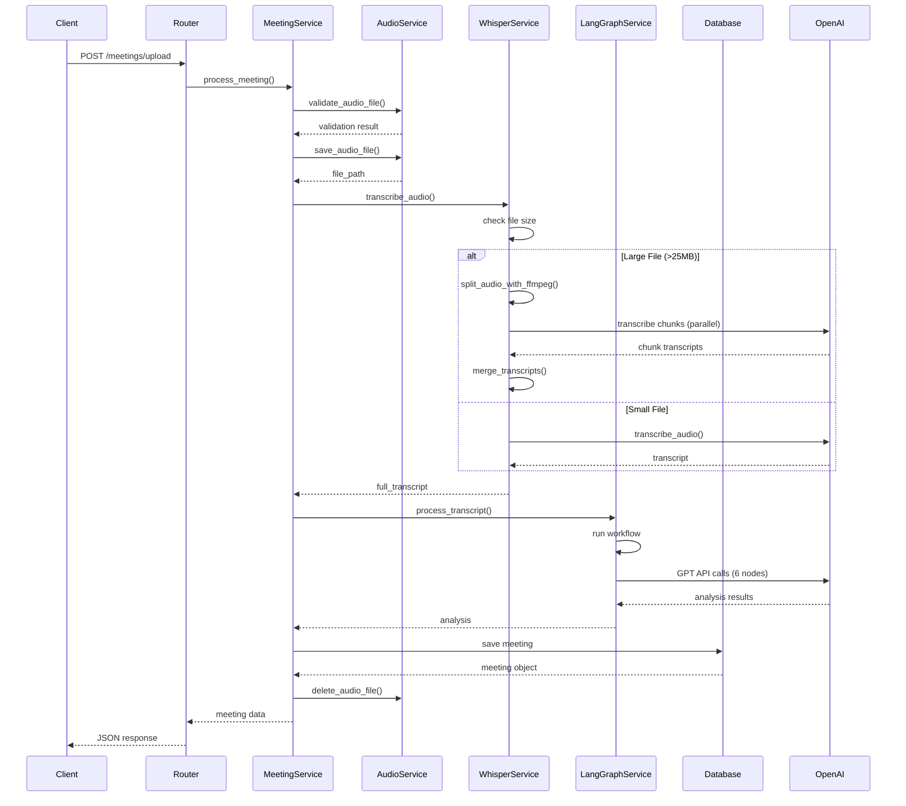
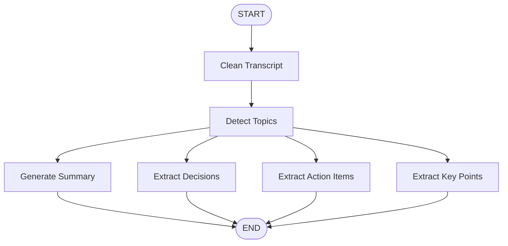

# MeetMind Architecture Documentation

## Table of Contents
- [System Overview](#system-overview)
- [Technology Stack](#technology-stack)
- [Architecture Layers](#architecture-layers)
- [Component Interaction](#component-interaction)
- [Data Flow](#data-flow)
- [LangGraph Workflow](#langgraph-workflow)
- [Database Design](#database-design)
- [Security Architecture](#security-architecture)

---

## System Overview

MeetMind is a production-ready FastAPI backend that transforms meeting audio into actionable insights through a multi-stage AI pipeline. The system leverages OpenAI's Whisper for speech-to-text transcription and LangGraph for intelligent analysis.

### Key Capabilities
- **Audio Processing**: Multi-format support (WAV, MP3, WebM, M4A, OGG) with automatic chunking for large files
- **Speech-to-Text**: Cloud-based Whisper API with FFmpeg-powered chunking and parallel processing
- **AI Analysis**: 6-node LangGraph workflow for comprehensive meeting insights
- **User Isolation**: Complete data separation between users
- **RESTful API**: Clean, documented endpoints with Pydantic validation

---

## Technology Stack

### Core Framework
- **FastAPI** (0.128.6): Modern, high-performance web framework
- **Uvicorn** (0.40.0): ASGI server for production deployment
- **Python 3.9+**: Runtime environment

### AI & Machine Learning
- **OpenAI API** (2.17.0): Whisper transcription and GPT analysis
- **LangGraph** (1.0.8): Workflow orchestration for AI agents
- **LangChain** (1.2.9): LLM integration framework
- **LangChain-OpenAI** (1.1.8): OpenAI-specific integrations

### Database & ORM
- **SQLAlchemy** (2.0.46): SQL toolkit and ORM
- **SQLite**: Default database (production should use PostgreSQL)
- **Alembic** (1.18.3): Database migrations

### Configuration & Validation
- **Pydantic** (2.12.5): Data validation and settings management
- **Pydantic-Settings** (2.1.0): Environment-based configuration
- **Python-Dotenv** (1.2.1): Environment variable loading

### Audio Processing
- **FFmpeg**: External dependency for audio manipulation
- **FFprobe**: Audio metadata extraction

---

## Architecture Layers

MeetMind follows a clean, layered architecture:

```
┌─────────────────────────────────────────────────────────┐
│                     API Layer                           │
│  (FastAPI Routers - HTTP Request/Response Handling)     │
└─────────────────────────────────────────────────────────┘
                          ↓
┌─────────────────────────────────────────────────────────┐
│                   Service Layer                         │
│  (Business Logic & Orchestration)                       │
│  • MeetingService  • AudioService                       │
│  • WhisperService  • LangGraphService                   │
└─────────────────────────────────────────────────────────┘
                          ↓
┌─────────────────────────────────────────────────────────┐
│                   Data Layer                            │
│  (SQLAlchemy Models & Database Access)                  │
└─────────────────────────────────────────────────────────┘
                          ↓
┌─────────────────────────────────────────────────────────┐
│                  External Services                      │
│  • OpenAI Whisper API  • OpenAI GPT API                 │
└─────────────────────────────────────────────────────────┘
```

### Layer Responsibilities

#### 1. API Layer (`app/routers/`)
- HTTP request handling and routing
- Request validation using Pydantic schemas
- Response serialization
- Error handling and HTTP status codes

#### 2. Service Layer (`app/services/`)
- **MeetingService**: Orchestrates the complete workflow
- **AudioService**: File validation, storage, and cleanup
- **WhisperService**: Audio transcription with chunking
- **LangGraphService**: AI-powered analysis pipeline

#### 3. Data Layer (`app/models/`, `app/database.py`)
- SQLAlchemy ORM models
- Database session management
- Query operations
- Data persistence

#### 4. Schema Layer (`app/schemas/`)
- Pydantic models for validation
- Request/response serialization
- Type safety and documentation

---

## Component Interaction

### Complete Request Flow



---

## Data Flow

### 1. Audio Upload Flow

```
Client Audio File
    ↓
[Validation] → Check format, size, MIME type
    ↓
[Storage] → Save to uploads/ with UUID filename
    ↓
[Metadata] → Extract duration, file size
    ↓
Next: Transcription
```

### 2. Transcription Flow

```
Audio File Path
    ↓
[Size Check] → Is file > 25MB?
    ↓
    ├─ YES → [FFmpeg Chunking]
    │           ↓
    │        [10-min chunks with 10s overlap]
    │           ↓
    │        [Parallel Transcription] (ThreadPoolExecutor)
    │           ↓
    │        [Merge Transcripts]
    │
    └─ NO → [Direct Transcription]
    ↓
Full Transcript Text
```

### 3. AI Analysis Flow

```
Transcript Text
    ↓
[Node 1] Clean Transcript → Remove fillers, fix grammar
    ↓
[Node 2] Detect Topics → Identify discussion themes
    ↓
    ├─→ [Node 3] Generate Summary
    ├─→ [Node 4] Extract Decisions
    ├─→ [Node 5] Extract Action Items
    └─→ [Node 6] Extract Key Points
    ↓
Structured Analysis Results
```

### 4. Data Persistence Flow

```
Analysis Results
    ↓
[User Check] → Get or create user
    ↓
[Create Meeting] → Build Meeting object
    ↓
[JSON Serialization] → Convert lists to JSON strings
    ↓
[Database Commit] → Save to SQLite
    ↓
[Cleanup] → Delete temporary audio file
    ↓
Return Meeting Object
```

---

## LangGraph Workflow

### Workflow Architecture

LangGraph orchestrates a stateful, multi-node workflow for meeting analysis:



### Node Details

#### Node 1: Clean Transcript
- **Purpose**: Prepare transcript for analysis
- **Operations**:
  - Remove filler words (um, uh, like, you know)
  - Fix grammar and punctuation
  - Improve readability
- **LLM Model**: GPT-4o-mini
- **Temperature**: 0.3 (focused, deterministic)

#### Node 2: Detect Topics
- **Purpose**: Identify main discussion themes
- **Operations**:
  - Analyze conversation flow
  - Extract 3-5 main topics
  - Categorize discussion areas
- **Output**: List of topic strings

#### Node 3: Generate Summary
- **Purpose**: Create concise meeting overview
- **Operations**:
  - Synthesize key information
  - 2-4 sentence summary
  - Focus on outcomes and context
- **Output**: Single summary string

#### Node 4: Extract Decisions
- **Purpose**: Identify commitments and choices
- **Operations**:
  - Find explicit decisions
  - Capture agreements
  - Note consensus points
- **Output**: List of decision strings

#### Node 5: Extract Action Items
- **Purpose**: Capture tasks and assignments
- **Operations**:
  - Identify actionable tasks
  - Extract assignments
  - Note deadlines if mentioned
- **Output**: List of action item strings

#### Node 6: Extract Key Points
- **Purpose**: Highlight important discussion points
- **Operations**:
  - Identify critical information
  - Extract notable mentions
  - Capture important context
- **Output**: List of key point strings

### State Management

The workflow uses a `MeetingState` TypedDict:

```python
class MeetingState(TypedDict):
    transcript: str              # Original transcript
    cleaned_transcript: str      # Cleaned version
    topics: List[str]           # Detected topics
    summary: str                # Meeting summary
    decisions: List[str]        # Decisions made
    action_items: List[str]     # Action items
    key_points: List[str]       # Key discussion points
```

State flows through nodes, with each node reading and updating relevant fields.

---

## Database Design

### Schema Overview

```
┌─────────────────┐
│     Users       │
├─────────────────┤
│ id (PK)         │──┐
│ created_at      │  │
└─────────────────┘  │
                     │ 1:N
                     │
┌─────────────────┐  │
│    Meetings     │  │
├─────────────────┤  │
│ id (PK)         │  │
│ user_id (FK)    │──┘
│ audio_filename  │
│ transcript      │
│ summary         │
│ decisions       │ (JSON as TEXT)
│ action_items    │ (JSON as TEXT)
│ key_points      │ (JSON as TEXT)
│ created_at      │
└─────────────────┘
```

### Table Details

#### Users Table
- **Purpose**: Store user information
- **Fields**:
  - `id`: String(36) - UUID as string for SQLite compatibility
  - `created_at`: DateTime - User creation timestamp
- **Relationships**: One-to-many with Meetings
- **Cascade**: Delete meetings when user is deleted

#### Meetings Table
- **Purpose**: Store meeting data and AI analysis
- **Fields**:
  - `id`: String(36) - UUID as string
  - `user_id`: String(36) - Foreign key to Users
  - `audio_filename`: String(255) - Original filename
  - `transcript`: Text - Full transcription
  - `summary`: Text - AI-generated summary
  - `decisions`: Text - JSON array stored as text
  - `action_items`: Text - JSON array stored as text
  - `key_points`: Text - JSON array stored as text
  - `created_at`: DateTime - Meeting creation timestamp
- **Indexes**: 
  - `idx_meetings_user_id` on `user_id` for fast user queries
- **Relationships**: Many-to-one with Users

### Design Decisions

1. **UUID as String**: SQLite doesn't have native UUID type, so UUIDs are stored as 36-character strings
2. **JSON as Text**: Lists stored as JSON strings for SQLite compatibility (PostgreSQL would use JSONB)
3. **Text Fields**: Transcripts can be very long, requiring TEXT type
4. **Cascade Delete**: When a user is deleted, all their meetings are automatically removed
5. **Indexing**: User ID indexed for fast retrieval of user's meetings

---

## Security Architecture

### Current Security Features

#### 1. User Isolation
- **Mechanism**: User ID validation on all queries
- **Implementation**: `get_meeting_by_id()` verifies ownership
- **Protection**: Users cannot access other users' meetings

#### 2. Input Validation
- **File Type**: Whitelist of allowed audio formats
- **MIME Type**: Content-Type header validation
- **File Size**: Configurable upload size limits (default 100MB)
- **Pydantic Schemas**: Type validation on all API inputs

#### 3. Error Handling
- **Generic Errors**: Don't expose internal details
- **HTTP Status Codes**: Proper 400, 403, 404, 500 responses
- **Exception Handling**: Try-catch blocks prevent crashes

#### 4. File Management
- **Unique Filenames**: UUID-based to prevent collisions
- **Temporary Storage**: Files deleted after processing
- **Directory Isolation**: Uploads stored in dedicated directory

### Production Security Recommendations

> [!WARNING]
> The current implementation is suitable for development but requires enhancements for production:

1. **Authentication**: Add JWT or OAuth2 authentication
2. **Authorization**: Implement role-based access control (RBAC)
3. **CORS**: Configure specific allowed origins (currently allows all)
4. **API Keys**: Secure OpenAI API key in secrets manager
5. **HTTPS**: Use TLS/SSL in production
6. **Rate Limiting**: Prevent abuse with request throttling
7. **Input Sanitization**: Additional validation for SQL injection prevention
8. **Audit Logging**: Track all data access and modifications
9. **Database**: Use PostgreSQL with proper connection pooling
10. **Secrets**: Use environment-specific secret management

---

## Performance Considerations

### Optimization Strategies

#### 1. Parallel Processing
- **Whisper Chunks**: Transcribed in parallel using ThreadPoolExecutor
- **Benefit**: 3-5x faster for large files
- **Trade-off**: Higher memory usage during processing

#### 2. Async Operations
- **FastAPI**: Async endpoints for non-blocking I/O
- **File Upload**: Async file reading
- **Database**: Sync ORM (consider async SQLAlchemy for high load)

#### 3. Chunking Strategy
- **10-minute chunks**: Balance between API limits and overhead
- **10-second overlap**: Ensures no content loss at boundaries
- **FFmpeg**: Efficient, low-memory audio splitting

#### 4. Resource Management
- **File Cleanup**: Immediate deletion after processing
- **Database Sessions**: Proper session lifecycle management
- **Connection Pooling**: SQLAlchemy session factory

### Scalability Considerations

For high-volume production deployments:

1. **Database**: Migrate to PostgreSQL with read replicas
2. **File Storage**: Use S3/GCS instead of local filesystem
3. **Queue System**: Add Celery/RQ for async processing
4. **Caching**: Redis for frequently accessed data
5. **Load Balancing**: Multiple Uvicorn workers behind nginx
6. **Monitoring**: Prometheus + Grafana for metrics
7. **Logging**: Centralized logging with ELK stack

---

## Configuration Management

### Environment Variables

Configuration is managed through `.env` file and Pydantic Settings:

```python
class Settings(BaseSettings):
    # Database
    database_url: str = "sqlite:///./data/meetmind.db"
    
    # Upload
    upload_dir: str = "./uploads"
    max_upload_size_mb: int = 100
    
    # OpenAI
    openai_api_key: Optional[str] = None
    
    # Application
    app_name: str = "MeetMind"
    debug: bool = True
```

### Configuration Hierarchy

1. Environment variables (highest priority)
2. `.env` file
3. Default values in Settings class

### Directory Auto-Creation

The system automatically creates required directories:
- `uploads/` - Temporary audio storage
- `data/` - SQLite database location

---

## Error Handling Strategy

### Error Categories

#### 1. Client Errors (4xx)
- **400 Bad Request**: Invalid file type, validation failures
- **403 Forbidden**: User doesn't own requested resource
- **404 Not Found**: Meeting or resource doesn't exist
- **413 Payload Too Large**: File exceeds size limit

#### 2. Server Errors (5xx)
- **500 Internal Server Error**: Unexpected failures
- **503 Service Unavailable**: External API failures

### Error Flow

```
Exception Raised
    ↓
[HTTPException?]
    ├─ YES → Return with status code and detail
    └─ NO → Catch in service layer
              ↓
           [Log Error]
              ↓
           [Rollback DB if needed]
              ↓
           [Cleanup Resources]
              ↓
           [Raise HTTPException(500)]
```

### Cleanup Guarantees

All operations use try-finally blocks to ensure:
- Temporary files are deleted
- Database sessions are closed
- Resources are released

---

## Future Architecture Enhancements

### Planned Improvements

1. **Microservices**: Split into separate services for transcription and analysis
2. **Event-Driven**: Use message queues for async processing
3. **Caching Layer**: Redis for API responses and analysis results
4. **WebSocket Support**: Real-time progress updates during processing
5. **Multi-Model Support**: Support for other transcription services (AssemblyAI, Deepgram)
6. **Advanced Analytics**: Meeting insights dashboard and trends
7. **Export Formats**: PDF, DOCX export of meeting summaries
8. **Speaker Diarization**: Identify and label different speakers
9. **Multi-Language**: Support for non-English meetings
10. **Collaborative Features**: Shared meetings, comments, annotations
