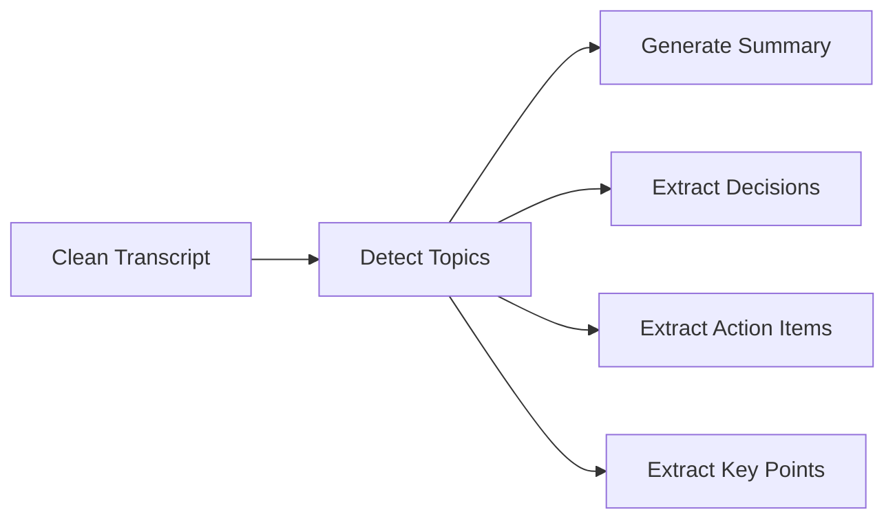

# MeetMind Developer Guide

## Table of Contents
- [Project Structure](#project-structure)
- [Code Architecture](#code-architecture)
- [Service Layer Details](#service-layer-details)
- [Database Layer](#database-layer)
- [Adding New Features](#adding-new-features)
- [Testing Guide](#testing-guide)
- [Code Style](#code-style)
- [Contributing](#contributing)

---

## Project Structure

```
MeetMind/
├── app/                          # Main application package
│   ├── __init__.py              # Package initialization
│   ├── main.py                  # FastAPI app entry point
│   ├── config.py                # Configuration management
│   ├── database.py              # Database setup and session
│   │
│   ├── models/                  # SQLAlchemy ORM models
│   │   ├── __init__.py
│   │   └── meeting.py           # User and Meeting models
│   │
│   ├── schemas/                 # Pydantic validation schemas
│   │   ├── __init__.py
│   │   └── meeting.py           # Request/response schemas
│   │
│   ├── routers/                 # API route handlers
│   │   ├── __init__.py
│   │   └── meetings.py          # Meeting endpoints
│   │
│   └── services/                # Business logic layer
│       ├── __init__.py
│       ├── audio_service.py     # Audio file handling
│       ├── whisper_service.py   # Speech-to-text
│       ├── langgraph_service.py # AI analysis
│       └── meeting_service.py   # Workflow orchestration
│
├── tests/                       # Test suite
│   ├── __init__.py
│   ├── conftest.py             # Pytest fixtures
│   ├── test_api.py             # API endpoint tests
│   ├── test_audio_service.py   # Audio service tests
│   ├── test_langgraph_service.py # LangGraph tests
│   └── test_models.py          # Model tests
│
├── docs/                        # Documentation
│   ├── ARCHITECTURE.md         # System architecture
│   ├── API.md                  # API reference
│   ├── DEPLOYMENT.md           # Deployment guide
│   └── DEVELOPER.md            # This file
│
├── data/                        # SQLite database (gitignored)
├── uploads/                     # Temporary audio files (gitignored)
├── venv/                        # Virtual environment (gitignored)
│
├── .env                         # Environment variables (gitignored)
├── .env.example                # Environment template
├── .gitignore                  # Git ignore rules
├── requirements.txt            # Python dependencies
├── requirements-dev.txt        # Development dependencies
├── run_tests.py               # Test runner script
├── README.md                  # Project overview
└── TESTING.md                 # Testing documentation
```

---

## Code Architecture

### Layered Architecture

MeetMind follows a clean, layered architecture pattern:

```
┌──────────────────────────────────────┐
│         API Layer (Routers)          │  ← HTTP handling
├──────────────────────────────────────┤
│       Service Layer (Services)       │  ← Business logic
├──────────────────────────────────────┤
│      Data Layer (Models + DB)        │  ← Data persistence
└──────────────────────────────────────┘
```

### Design Principles

1. **Separation of Concerns**: Each layer has a single responsibility
2. **Dependency Injection**: Database sessions injected via FastAPI
3. **Type Safety**: Pydantic schemas for validation
4. **Error Handling**: Consistent HTTPException usage
5. **Resource Management**: Proper cleanup in finally blocks

---

## Service Layer Details

### AudioService

**Purpose:** Handle audio file validation, storage, and cleanup

**Key Methods:**

#### `validate_audio_file(file: UploadFile) -> None`
Validates file format and MIME type.

```python
# Allowed formats
ALLOWED_EXTENSIONS = {".wav", ".mp3", ".webm", ".m4a", ".ogg"}
ALLOWED_MIME_TYPES = {
    "audio/wav", "audio/wave", "audio/x-wav",
    "audio/mpeg", "audio/mp3",
    "audio/webm",
    "audio/mp4", "audio/x-m4a",
    "audio/ogg"
}
```

#### `save_audio_file(file: UploadFile) -> Tuple[str, str]`
Saves file with UUID filename, returns (path, original_filename).

**Implementation Details:**
- Generates UUID-based filename to prevent collisions
- Checks file size against `MAX_UPLOAD_SIZE_MB`
- Returns both file path and original filename

#### `delete_audio_file(file_path: str) -> None`
Deletes temporary audio file (best-effort, doesn't raise errors).

---

### WhisperService

**Purpose:** Transcribe audio using OpenAI Whisper API with automatic chunking

**Key Features:**
- Automatic chunking for files >25MB
- FFmpeg-based audio splitting
- Parallel chunk processing
- Overlap handling to prevent content loss

**Key Methods:**

#### `check_ffmpeg_available() -> bool`
Verifies FFmpeg and FFprobe are installed.

#### `get_audio_duration(file_path: str) -> float`
Uses FFprobe to get audio duration in seconds.

#### `validate_audio_file(file_path: str) -> Tuple[float, int]`
Returns (duration_minutes, file_size_bytes).

#### `split_audio_with_ffmpeg(input_path: str, duration_seconds: float) -> List[str]`
Splits audio into 10-minute chunks with 10-second overlap.

**Chunking Strategy:**
```python
CHUNK_DURATION_SECONDS = 600  # 10 minutes
OVERLAP_SECONDS = 10          # 10 seconds overlap
```

**FFmpeg Command:**
```bash
ffmpeg -i input.mp3 -ss <start> -t <duration> -c copy chunk.mp3
```

#### `transcribe_chunk(chunk_path: str, chunk_index: int, total_chunks: int) -> Tuple[int, str]`
Transcribes a single chunk using OpenAI Whisper API.

#### `transcribe_chunks_parallel(chunk_paths: List[str]) -> List[str]`
Transcribes multiple chunks in parallel using ThreadPoolExecutor.

**Parallelization:**
```python
with ThreadPoolExecutor(max_workers=5) as executor:
    futures = [executor.submit(transcribe_chunk, ...) for ...]
    results = [future.result() for future in as_completed(futures)]
```

#### `merge_overlapping_transcripts(transcripts: List[str]) -> str`
Combines chunk transcripts with simple concatenation.

#### `transcribe_audio(audio_path: str) -> str`
Main entry point - handles both small and large files.

**Flow:**
1. Check file size
2. If >25MB: chunk → parallel transcribe → merge
3. If ≤25MB: direct transcription
4. Return full transcript

---

### LangGraphService

**Purpose:** AI-powered meeting analysis using LangGraph workflow

**Architecture:**



**State Schema:**

```python
class MeetingState(TypedDict):
    transcript: str
    cleaned_transcript: str
    topics: List[str]
    summary: str
    decisions: List[str]
    action_items: List[str]
    key_points: List[str]
```

**Key Methods:**

#### `__init__()`
Initializes ChatOpenAI with GPT-4o-mini model.

```python
self.llm = ChatOpenAI(
    model="gpt-4o-mini",
    temperature=0.3,
    api_key=settings.openai_api_key
)
```

#### Node Functions

Each node is a method that takes `MeetingState` and returns updated state:

1. **`clean_transcript(state)`**: Remove fillers, fix grammar
2. **`detect_topics(state)`**: Identify 3-5 main topics
3. **`generate_summary(state)`**: Create 2-4 sentence summary
4. **`extract_decisions(state)`**: Find decisions and agreements
5. **`extract_action_items(state)`**: Identify tasks and assignments
6. **`extract_key_points(state)`**: Extract important discussion points

**Prompt Engineering:**

Each node uses carefully crafted prompts:

```python
# Example: Summary generation
prompt = ChatPromptTemplate.from_template(
    "Summarize this meeting transcript in 2-4 sentences:\n\n{transcript}"
)
```

#### `build_graph() -> CompiledGraph`
Constructs the LangGraph workflow.

```python
workflow = StateGraph(MeetingState)
workflow.add_node("clean", self.clean_transcript)
workflow.add_node("topics", self.detect_topics)
# ... add other nodes
workflow.add_edge("clean", "topics")
workflow.add_edge("topics", "summary")
# ... add other edges
workflow.set_entry_point("clean")
return workflow.compile()
```

#### `process_transcript(transcript: str) -> Dict[str, Any]`
Main entry point - runs the workflow and returns results.

**Return Format:**
```python
{
    "summary": str,
    "decisions": List[str],
    "action_items": List[str],
    "key_points": List[str]
}
```

---

### MeetingService

**Purpose:** Orchestrate the complete meeting processing workflow

**Key Methods:**

#### `get_or_create_user(db: Session, user_id: str) -> User`
Ensures user exists in database.

```python
user = db.query(User).filter(User.id == user_id).first()
if not user:
    user = User(id=user_id)
    db.add(user)
    db.commit()
return user
```

#### `process_meeting(db: Session, user_id: str, audio_file: UploadFile) -> Meeting`
Complete workflow orchestration.

**Workflow Steps:**
1. Validate audio file
2. Save to disk
3. Transcribe with Whisper
4. Analyze with LangGraph
5. Get/create user
6. Save to database
7. Cleanup temporary file

**Error Handling:**
```python
try:
    # ... processing steps
except HTTPException:
    raise  # Re-raise HTTP exceptions
except Exception as e:
    db.rollback()
    raise HTTPException(status_code=500, detail=str(e))
finally:
    # Always cleanup
    if audio_path:
        self.audio_service.delete_audio_file(audio_path)
```

#### `get_user_meetings(db: Session, user_id: str) -> List[Meeting]`
Retrieves all meetings for a user, ordered by creation date (newest first).

#### `get_meeting_by_id(db: Session, meeting_id: str, user_id: str) -> Meeting`
Retrieves specific meeting with user authorization check.

**Authorization:**
```python
if meeting.user_id != user_id:
    raise HTTPException(status_code=403, detail="Access denied")
```

---

## Database Layer

### Models

#### User Model

```python
class User(Base):
    __tablename__ = "users"
    
    id = Column(String(36), primary_key=True, default=generate_uuid)
    created_at = Column(DateTime, nullable=False, default=datetime.utcnow)
    
    # Relationships
    meetings = relationship("Meeting", back_populates="user", 
                          cascade="all, delete-orphan")
```

**Key Features:**
- UUID stored as string for SQLite compatibility
- One-to-many relationship with meetings
- Cascade delete (deleting user deletes all meetings)

#### Meeting Model

```python
class Meeting(Base):
    __tablename__ = "meetings"
    
    id = Column(String(36), primary_key=True, default=generate_uuid)
    user_id = Column(String(36), ForeignKey("users.id"), nullable=False)
    audio_filename = Column(String(255), nullable=False)
    transcript = Column(Text, nullable=True)
    summary = Column(Text, nullable=True)
    decisions = Column(Text, nullable=True)      # JSON as text
    action_items = Column(Text, nullable=True)   # JSON as text
    key_points = Column(Text, nullable=True)     # JSON as text
    created_at = Column(DateTime, nullable=False, default=datetime.utcnow)
    
    # Relationships
    user = relationship("User", back_populates="meetings")
    
    # Indexes
    __table_args__ = (
        Index('idx_meetings_user_id', 'user_id'),
    )
```

**Key Features:**
- Foreign key to users table
- JSON arrays stored as text (for SQLite)
- Index on user_id for fast queries
- Many-to-one relationship with users

### Database Session Management

```python
def get_db() -> Session:
    """Dependency for database sessions"""
    db = SessionLocal()
    try:
        yield db
    finally:
        db.close()
```

**Usage in Routes:**
```python
@router.post("/upload")
async def upload_meeting(
    user_id: str = Form(...),
    audio_file: UploadFile = File(...),
    db: Session = Depends(get_db)  # Injected
):
    # ... use db
```

---

## Adding New Features

### Adding a New Endpoint

**Step 1:** Define Pydantic schema in `app/schemas/`

```python
# app/schemas/meeting.py
class NewFeatureRequest(BaseModel):
    field1: str
    field2: int

class NewFeatureResponse(BaseModel):
    result: str
```

**Step 2:** Add business logic to service

```python
# app/services/meeting_service.py
class MeetingService:
    def new_feature_logic(self, data: dict) -> dict:
        # Business logic here
        return {"result": "success"}
```

**Step 3:** Add route handler

```python
# app/routers/meetings.py
@router.post("/new-feature", response_model=NewFeatureResponse)
def new_feature_endpoint(
    request: NewFeatureRequest,
    db: Session = Depends(get_db)
):
    service = MeetingService()
    result = service.new_feature_logic(request.dict())
    return NewFeatureResponse(**result)
```

**Step 4:** Add tests

```python
# tests/test_api.py
def test_new_feature(client):
    response = client.post("/new-feature", json={
        "field1": "value",
        "field2": 123
    })
    assert response.status_code == 200
```

### Adding a New LangGraph Node

**Step 1:** Update state schema

```python
# app/services/langgraph_service.py
class MeetingState(TypedDict):
    # ... existing fields
    new_field: List[str]  # Add new field
```

**Step 2:** Create node function

```python
def extract_new_feature(self, state: MeetingState) -> MeetingState:
    """Extract new feature from transcript"""
    prompt = ChatPromptTemplate.from_template(
        "Extract new feature from:\n\n{transcript}"
    )
    chain = prompt | self.llm
    result = chain.invoke({"transcript": state["cleaned_transcript"]})
    
    # Parse result
    items = [item.strip() for item in result.content.split("\n") if item.strip()]
    
    return {**state, "new_field": items}
```

**Step 3:** Add to workflow

```python
def build_graph(self):
    workflow = StateGraph(MeetingState)
    # ... existing nodes
    workflow.add_node("new_feature", self.extract_new_feature)
    workflow.add_edge("topics", "new_feature")
    workflow.add_edge("new_feature", END)
    return workflow.compile()
```

**Step 4:** Update database model

```python
# app/models/meeting.py
class Meeting(Base):
    # ... existing fields
    new_field = Column(Text, nullable=True)
```

**Step 5:** Update response schema

```python
# app/schemas/meeting.py
class MeetingDetailResponse(BaseModel):
    # ... existing fields
    new_field: List[str] = Field(default_factory=list)
```

---

## Testing Guide

### Running Tests

```bash
# Run all tests
pytest

# Run with verbose output
pytest -v

# Run specific test file
pytest tests/test_api.py

# Run specific test
pytest tests/test_api.py::test_upload_meeting

# Run with coverage
pytest --cov=app --cov-report=html
```

### Test Structure

Tests use pytest with fixtures defined in `conftest.py`:

```python
# tests/conftest.py
@pytest.fixture
def client():
    """FastAPI test client"""
    return TestClient(app)

@pytest.fixture
def db_session():
    """Database session for testing"""
    # ... setup test database
    yield session
    # ... cleanup
```

### Writing Tests

#### API Tests

```python
# tests/test_api.py
def test_upload_meeting(client, mocker):
    # Mock external services
    mocker.patch('app.services.whisper_service.WhisperService.transcribe_audio',
                 return_value="Test transcript")
    mocker.patch('app.services.langgraph_service.LangGraphService.process_transcript',
                 return_value={
                     "summary": "Test summary",
                     "decisions": [],
                     "action_items": [],
                     "key_points": []
                 })
    
    # Create test file
    files = {"audio_file": ("test.mp3", b"fake audio data", "audio/mpeg")}
    data = {"user_id": "test-user"}
    
    # Make request
    response = client.post("/meetings/upload", files=files, data=data)
    
    # Assertions
    assert response.status_code == 200
    assert "meeting_id" in response.json()
```

#### Service Tests

```python
# tests/test_audio_service.py
def test_validate_audio_file():
    # Create mock file
    file = UploadFile(filename="test.mp3", content_type="audio/mpeg")
    
    # Should not raise
    AudioService.validate_audio_file(file)
    
    # Invalid file should raise
    invalid_file = UploadFile(filename="test.txt", content_type="text/plain")
    with pytest.raises(HTTPException):
        AudioService.validate_audio_file(invalid_file)
```

### Mocking External APIs

Always mock OpenAI API calls in tests:

```python
@pytest.fixture
def mock_openai(mocker):
    mocker.patch('openai.resources.audio.transcriptions.Transcriptions.create',
                 return_value=Mock(text="Mocked transcript"))
    mocker.patch('langchain_openai.ChatOpenAI.invoke',
                 return_value=Mock(content="Mocked response"))
```

---

## Code Style

### Python Style Guide

Follow PEP 8 with these specifics:

- **Line Length**: 100 characters max
- **Indentation**: 4 spaces
- **Imports**: Grouped (stdlib, third-party, local)
- **Docstrings**: Google style

### Example Code Style

```python
"""Module docstring explaining purpose"""

from typing import List, Dict, Any
import os

from fastapi import HTTPException
from sqlalchemy.orm import Session

from app.models.meeting import Meeting


class ServiceName:
    """Class docstring.
    
    Attributes:
        attribute_name: Description
    """
    
    def method_name(self, param: str) -> Dict[str, Any]:
        """Method docstring.
        
        Args:
            param: Parameter description
            
        Returns:
            Return value description
            
        Raises:
            HTTPException: When error occurs
        """
        try:
            # Implementation
            result = self._helper_method(param)
            return {"data": result}
        except Exception as e:
            raise HTTPException(status_code=500, detail=str(e))
    
    def _helper_method(self, param: str) -> str:
        """Private helper method"""
        return param.upper()
```

### Type Hints

Always use type hints:

```python
# Good
def process_data(items: List[str], count: int) -> Dict[str, Any]:
    return {"items": items, "count": count}

# Bad
def process_data(items, count):
    return {"items": items, "count": count}
```

### Error Handling

Use HTTPException for API errors:

```python
# Good
if not meeting:
    raise HTTPException(status_code=404, detail="Meeting not found")

# Bad
if not meeting:
    return {"error": "Meeting not found"}
```

---

## Contributing

### Development Workflow

1. **Create Feature Branch**
   ```bash
   git checkout -b feature/new-feature
   ```

2. **Make Changes**
   - Write code following style guide
   - Add tests for new functionality
   - Update documentation

3. **Run Tests**
   ```bash
   pytest
   ```

4. **Commit Changes**
   ```bash
   git add .
   git commit -m "Add new feature: description"
   ```

5. **Push and Create PR**
   ```bash
   git push origin feature/new-feature
   ```

### Commit Message Format

```
<type>: <subject>

<body>

<footer>
```

**Types:**
- `feat`: New feature
- `fix`: Bug fix
- `docs`: Documentation
- `style`: Code style changes
- `refactor`: Code refactoring
- `test`: Adding tests
- `chore`: Maintenance

**Example:**
```
feat: Add speaker diarization support

- Implement speaker detection using pyannote
- Add speaker labels to transcript
- Update API response schema

Closes #123
```

### Code Review Checklist

- [ ] Code follows style guide
- [ ] Tests added and passing
- [ ] Documentation updated
- [ ] No hardcoded secrets
- [ ] Error handling implemented
- [ ] Type hints added
- [ ] Docstrings present
- [ ] No breaking changes (or documented)

---

## Useful Commands

### Development

```bash
# Start development server
uvicorn app.main:app --reload

# Run tests
pytest -v

# Run tests with coverage
pytest --cov=app --cov-report=html

# Format code (if using black)
black app/ tests/

# Lint code (if using flake8)
flake8 app/ tests/

# Type check (if using mypy)
mypy app/
```

### Database

```bash
# Initialize database
python -c "from app.database import init_db; init_db()"

# Drop all tables (SQLite)
rm data/meetmind.db

# Backup database
cp data/meetmind.db data/meetmind.db.backup
```

### Dependencies

```bash
# Install dependencies
pip install -r requirements.txt

# Install dev dependencies
pip install -r requirements-dev.txt

# Update requirements
pip freeze > requirements.txt

# Check for outdated packages
pip list --outdated
```

---

## Resources

### Documentation
- [FastAPI Docs](https://fastapi.tiangolo.com/)
- [SQLAlchemy Docs](https://docs.sqlalchemy.org/)
- [Pydantic Docs](https://docs.pydantic.dev/)
- [LangGraph Docs](https://langchain-ai.github.io/langgraph/)
- [OpenAI API Docs](https://platform.openai.com/docs/)

### Tools
- [Postman](https://www.postman.com/) - API testing
- [DBeaver](https://dbeaver.io/) - Database management
- [VS Code](https://code.visualstudio.com/) - Code editor

### Learning
- [FastAPI Tutorial](https://fastapi.tiangolo.com/tutorial/)
- [SQLAlchemy Tutorial](https://docs.sqlalchemy.org/en/20/tutorial/)
- [LangChain Tutorials](https://python.langchain.com/docs/get_started/introduction)
